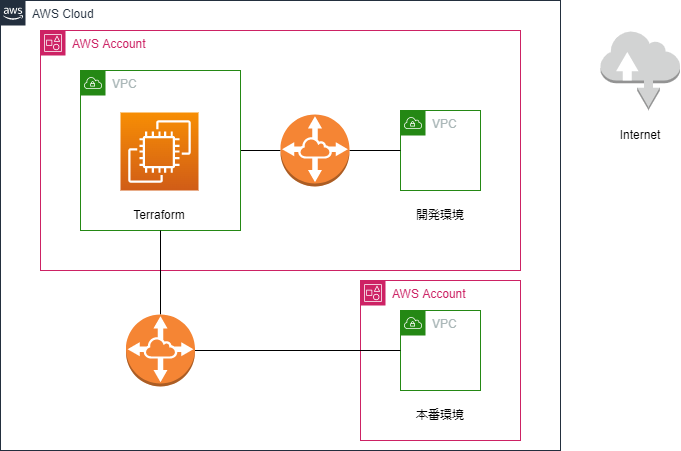

# AWSクラウド上にTerraformの実行環境を作る

　開発アカウントの実行環境とは異なるVPCを新たに作り、Terraformを実行するEC2インスタンスを設置します。
VPC間の通信はグローバル AWS バックボーンで行われ、パブリックインターネットを経由することはないため、高速かつ安全に作業を行うことができます。

## 導入の仕方

1. [CloudFormation](https://ap-northeast-1.console.aws.amazon.com/cloudformation/home) にアクセスします。
1. **スタックの作成** をクリックします。
1. テンプレート `cfn_terraform_on_aws.yaml` をアップロードします。

