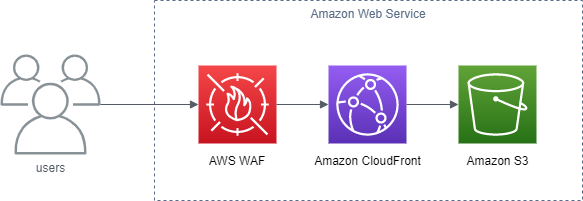

# static_web_site モジュール

静的なWebサイトを公開するサーバレス環境を提供します。



- **AWS WAF** - IPアドレスによるサイトへのアクセス制限を行います
- **Amazon CloudFront** - コンテンツデリバリーネットワーク(CDN)
- **Amazon S3** - コンテンツのオリジンを保存します

## 使い方

main.tf に `module "static_web_site" {...}` を追記します。

* main.tf

  ```
  terraform {
    required_providers {
      aws = {
        source  = "hashicorp/aws"
        version = "~> 3.0"
        # https://www.terraform.io/language/providers/configuration#alias-multiple-provider-configurations
        configuration_aliases = [aws.verginia]
      }
    }
  }

  # The default provider configuration; resources that begin with `aws_` will use
  # it as the default, and it can be referenced as `aws`.
  provider "aws" {
    region = "ap-northeast-1"
  }

  # Additional provider configuration
  provider "aws" {
    alias = "virginia"
    region = "us-east-1"
  }

  module "static_web_sites" {
    source = "./static_web_site"
    # For CLOUDFRONT, you must create your WAFv2 resources in the US East (N. Virginia) Region, us-east-1.
    # https://docs.aws.amazon.com/ja_jp/AWSCloudFormation/latest/UserGuide/aws-resource-wafv2-webacl.html#aws-resource-wafv2-webacl-properties 
    providers = {
      aws = aws.virginia
    }
    sites = {
      {your-site-id} = {
        comment             = "It's my site."
        default_root_object = "index.html"
        allowed_methods     = ["DELETE", "GET", "HEAD", "OPTIONS", "PATCH", "POST", "PUT"]
        cached_methods      = ["GET", "HEAD"]
        default_ttl         = 3600  # 1時間
        max_ttl             = 86400 # 1日
        locations           = ["JP"]
        aliases             = ["doc.hokulea.io"]
        allow_addresses     = split(",", file("./white_ip.list"))
      }
    }
  }
  ```

- `{your-site-id}` - サイト名。英数字とハイフン、アンダースコアが使えます。
- `comment` - サイトの説明。
- `default_root_object` - エンドユーザーがルート URL をリクエストしたときに CloudFront が返すオブジェクト。デフォルトは`index.html`。
- `allowed_methods` - CloudFront が処理し、Amazon S3 バケットまたはカスタムオリジンに転送する HTTP メソッドを制御します。デフォルトは`["DELETE", "GET", "HEAD", "OPTIONS", "PATCH", "POST", "PUT"]`。
- `cached_methods` - 指定された HTTP メソッドを使用して CloudFront がリクエストへのレスポンスをキャッシュするかどうかを制御します。デフォルトは`["GET", "HEAD"]`。
- `default_ttl` - CloudFront が別のリクエストを転送する前に、オブジェクトが CloudFront キャッシュにあるデフォルトの時間 (秒単位) 。デフォルトは`3600`（1時間）。
- `max_ttl` - CloudFront が別のリクエストをオリジンに転送してオブジェクトが更新されたかどうかを判断する前に、オブジェクトが CloudFront キャッシュに存在する最大時間 (秒)。デフォルトは`86400`（1日）。
- `locations` - コンテンツを配布する国のホワイトリスト。デフォルトは`["JP"]`
- `aliases` - このディストリビューション用の追加の CNAME (代替ドメイン名) 。Route53などでドメインを取得している場合に指定します。